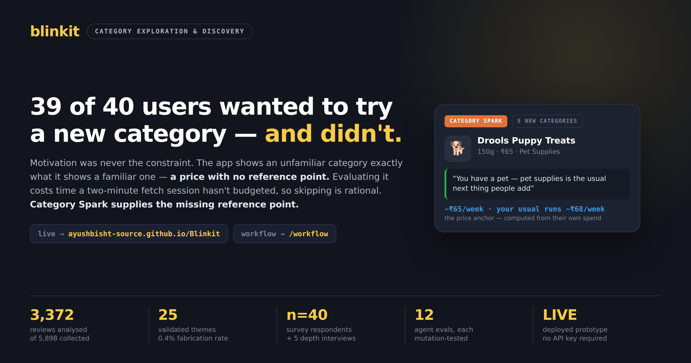

# Blinkit — Category Exploration & Discovery



Graduation project. Goal: increase the share of Monthly Active Customers who purchase from at least
one **new** category each month.

**Live MVP:** https://ayushbisht-source.github.io/Blinkit/  
**Review analysis workflow:** https://ayushbisht-source.github.io/Blinkit/workflow/  
**Case study deck:** https://ayushbisht-source.github.io/Blinkit/deck/ · [PPTX](deck/Blinkit-Category-Exploration.pptx) · [PDF](deck/Blinkit-Category-Exploration.pdf)

---

## The short version

Users are not failing to explore because they lack motivation, awareness, or trust in the platform.
Survey data rules out all three. They fail because **the app shows an unfamiliar category exactly
what it shows a familiar one — a price.** For a category you already buy, that is enough; you hold
the reference point in your head. For one you have never bought, a price with no reference point is
uninterpretable, so evaluating it costs time a two-minute fetch session has not budgeted, and
skipping is the rational move.

The MVP supplies the missing reference point.

---

## Repository map

| Path | What it is |
|---|---|
| `docs/00-foundation.md` | Metric definition (CER), target segment, ethics, declared limitations |
| `docs/02-user-research.md` | Part 2 — survey findings (n=40) and what they constrain |
| `docs/03-problem-definition.md` | Part 3 — root cause, workarounds, user and business case |
| `docs/04-mvp-spec.md` | Part 4 — the "One Thing" spec and why every obvious build was rejected |
| `docs/05-measurement-plan.md` | Primary metric, guardrails with kill thresholds, experiment design |
| `docs/06-prd.md` | **PRD** — the whole project as one product document ([PDF](docs/06-prd.pdf)) |
| `docs/ARCHITECTURE.md` | Original phase plan |
| `engine/` | Part 1 — the discovery engine |
| `mvp/` | Part 4 — the deployed prototype |
| `research/` | Survey instrument, interview kit, transcripts |
| `data/` | Corpus and pipeline outputs |

---

## Part 1 — The discovery engine

```
collect ──► normalize ──► relevance gate ──► extract ──► cluster ──► synthesize
                                                                        │
                                                                    validate
```

| Stage | Module | What it does |
|---|---|---|
| Collect | `engine/collectors/` | Play Store + App Store reviews across 5 quick-commerce apps |
| Normalize | `engine/pipeline/normalize.py` | PII scrubbing, Hinglish detection, MinHash near-dedupe |
| Gate | `engine/pipeline/enrich.py` | Cheap model filters out delivery/support/contentless noise |
| Extract | `engine/pipeline/enrich.py` | Structured extraction against `engine/schema.py` |
| Cluster | `engine/pipeline/cluster.py` | TF-IDF → LSA → agglomerative, then centroid merge |
| Synthesize | `engine/pipeline/synthesize.py` | Themes → insights with computed contradicting evidence |
| Validate | `engine/validation/checks.py` | Six checks — 4 pass, 2 report NOT RUN. No API key required |
| Cross-check | `engine/validation/multi_model.py` | Re-runs synthesis on a second model family and measures agreement |

### Corpus

| | |
|---|---|
| Documents collected | **5,898** across 11 apps — 5 quick-commerce, 3 marketplaces, 3 category specialists |
| Sources | Play Store (5,559) · App Store (339) |
| **Analysed in this submission** | **3,372** — the first collection. The 2,526 added later are collected but not yet gated or extracted; enrichment is resumable, so that is a re-run rather than a rebuild |
| Gated | **3,372 — complete** |
| Judged relevant | **971** (28.8%) |
| Filtered as noise | delivery 941 · support 550 · contentless 527 · technical 252 · unrelated 132 |

The gate removing ~71% of the corpus is the point, not a problem: most app-store reviews are about
delivery times and refunds, which say nothing about *what* people choose to buy. Extraction only
pays for documents that survive.

**One caveat on that filter, found by interview.** P03 described organising their basket around a
free-delivery threshold — a genuine constraint on *what gets bought*, expressed as a fee complaint.
Re-checking the corpus, 133 documents use that language and the gate rejected 64 of them as
`delivery` or `support` (`research/check_basket_economics.py`). The filter's premise — that fee and
delivery talk is logistics noise — is right most of the time and wrong in a specific, identifiable
way. It is documented in `docs/02-user-research.md` §8.3 rather than quietly retuned, because the
gate's error rate is part of what the discovery engine's output means.

### Design decisions worth knowing

**The schema is the single source of truth.** Every enum in `engine/schema.py` traces to one of the
brief's eight research questions, so coverage is checkable rather than asserted.

**Numbers never come from the model.** Prevalence, counts, source spread and segment skew are
computed from data and carried through synthesis untouched. The LLM sees labels and quotes only — it
cannot inflate a statistic it is never shown.

**Contradicting evidence is computed, not requested.** Asking a model for evidence against its own
conclusion reliably returns nothing. Instead the code counts documents *inside* each theme whose
labels disagree with that theme's dominant barrier.

**Every quote is verifiable.** Extraction must return a verbatim substring of the source document,
and validation asserts it character-for-character. That check is what licenses quoting the corpus at
all. Measured fabrication rate: **4 in 924** (0.4%), and clustering filters unverifiable quotes out
before any of them can be shown.

**The insights are cross-checked against a second model family.** Everything else in the engine is
counted or verified; the mechanism prose is not, so synthesis was re-run on Llama 3.3 70B and
compared with the Gemini output. Across all 25 themes: research-question agreement 0.66 Jaccard with
**no theme scoring zero overlap**, mean confidence gap 0.10, and mechanism text matching its own
counterpart **12/25 against a 4% chance baseline**. Agreement is not correctness — it bounds how much
the insights can be blamed on one vendor, nothing more (`engine/validation/multi_model.py`).

---

## Part 4 — The MVP: "One Thing"

Adjacent-category suggestions, fired at cart review. Not a feed, not a browse tab.

Each line of a card answers a blocker the survey named:

| Card element | Blocker closed | Survey n |
|---|---|---|
| Reason drawn from the user's own history | "not sure it'll suit my need" | 14/40 |
| **Price anchor** — ₹/week vs *their own* comparable spend | "priced higher than usual" / "price feels risky" | 15/40 |
| Trust signal from similar buyers | "don't trust the brand" / "want reviews first" | 26/40 |
| Smallest available pack | "too expensive" / "found cheaper elsewhere" | 20/40 |

**The row shows up to five, each opening a different new category.** The spec originally argued for
exactly one option, because comparison time is the #2 blocker (13/40) and one option leaves nothing
to compare. Showing five trades that away to buy five independent attempts at the metric — which
counts customers who buy from at least one new category per month — instead of one. The trade is
recorded in full in `docs/04-mvp-spec.md` ("Amendment — the row of five"), including what it gives
up. Every hard rule applies to every entry in the row, not just the first, and the eval suite checks
all five.

**Two modes, and only one of them can move CER.** Mode A is first crossover; Mode B fires when
someone bought a new category 2–6 weeks ago and hasn't returned. CER counts a purchase in month M
from a category absent in **M-1 … M-6**, so Mode B — which fires 14–45 days after the first
purchase — lands inside that lookback and contributes **zero** to it. An earlier version of the spec
had this backwards and gave Mode B priority; the correction and its evidence are in
`docs/04-mvp-spec.md`. Mode A now leads the row and Mode B takes the last slot, where it serves the
secondary metric it actually belongs to: *30-day repeat within a newly tried category*, which is what
stops CER being satisfied by one-off trials that never return.

```bash
node mvp/evals/cer-audit.mjs   # would accepting each suggestion register in CER?
```

Across the ten seeded shoppers: **35 of 36 row entries would count**, all 10 are offered at least one
category that counts, and the single entry that would not is the Mode B card.

### Running it

```bash
node mvp/evals/run.mjs      # the hard rules, as pass/fail assertions
```

The app runs entirely client-side on a deterministic path — **no API key required.** An LLM improves
the wording; the decisions are identical without one. That is deliberate: a demo that can be broken
by a quota reset is not a demo.

---

## Reproducing the pipeline

```bash
pip install -r requirements.txt
cp .env.example .env                     # set AUTHOR_HASH_SALT; add an API key for enrichment

python -m engine.collect --per-app 1000  # ~3.4k documents
python -m engine.pipeline.enrich         # gate + extract  (needs API key)
python -m engine.pipeline.cluster        # themes
python -m engine.pipeline.synthesize     # insights        (needs API key)
python -m engine.validation.checks       # validation      (no key needed)
```

Enrichment is **resumable** — completed `doc_id`s are skipped, so an interrupted run costs a retry
rather than the run.

Everything also runs on GitHub Actions (`.github/workflows/`), which is how it was actually
executed: the development sandbox is network-restricted from the review endpoints.

### On model providers

`engine/llm.py` auto-detects `ANTHROPIC_API_KEY`, then `GEMINI_API_KEY`. Gemini's free tier works
but its per-model daily caps and rate limits make a full corpus run impractically slow — measured at
~2 documents/minute once backoff dominates. `--probe-models` reports which models a key can actually
use, and the client rotates automatically as per-model quotas empty.

---

## Deployment

`mvp/` deploys to GitHub Pages via `.github/workflows/deploy-mvp.yml`.

One-time setup: **Settings → Pages → Source: GitHub Actions**. The deploy job runs the eval suite
first and refuses to publish if any check fails.

---

## Limitations

Stated up front rather than discovered by a reader.

1. **5 depth interviews, meeting the brief's minimum of 5–6.** Real, async over text, verbatim in
   `research/transcripts/` as P01–P05 across three platforms. Quantitative findings still rest on
   the survey alone; interview evidence is labelled n=5 everywhere it appears. Recruitment is
   convenience-sampled and inherits the survey's skew — the interviews correct its *vocabulary*, not
   its *sampling*. `docs/02-user-research.md` §8.8 separates what n=5 supports (the taxonomy is
   incomplete; the root-cause model does not cover everyone) from what it cannot (any "X% of users"
   claim, and none is made). No interview was fabricated and no synthetic persona is counted toward
   the total.
2. **The survey shares the engine's vocabulary by design**, so the two datasets compare directly —
   at the cost of being structurally poor at *challenging* the engine. It can confirm a hypothesised
   barrier; it cannot surface one nobody thought to ask about. Five interviews then found three
   barriers it has no name for: *"this category does not apply to me"* (3 of 5), using the app
   because nothing else was open (3 of 5), and organising the basket around a free-delivery
   threshold (1 of 5). The first two leave no text for the engine to mine. The third leaves
   plenty — **133 of the 3,372 collected documents** — and the schema has nowhere to put any of it
   (`research/check_basket_economics.py`). They also found something the schema cannot fix: two
   respondents have barriers **no information closes at all** — an incumbent kirana, and a belief
   settled by one bad delivery — which bounds the root cause rather than the vocabulary.
3. **AI-synthesized personas were generated and are excluded from the evidence base**
   (`docs/02-user-research.md` §6). They are retained as a labelled method artifact. A persona
   generated *from* survey data cannot contain what the survey did not capture — it can rephrase,
   never surprise. Of five hypotheses they produced, one was testable and it was wrong. That,
   against the enum gap two real conversations found, is this project's concrete demonstration of
   why AI research cannot replace primary research.
4. **n=40 convenience sample**, skewed young, metro and English-literate. Baby (3) and pet (2) owners
   are too thin to support claims about those segments.
5. **The MVP runs on synthetic order histories.** It demonstrates the mechanism, not real-world lift.
6. **Clustering uses TF-IDF + LSA rather than sentence embeddings** — deterministic and dependency-
   light, but it groups by shared vocabulary rather than pure semantics. Calibration measured
   against a synthetic corpus with planted themes is documented in `engine/pipeline/cluster.py`.
